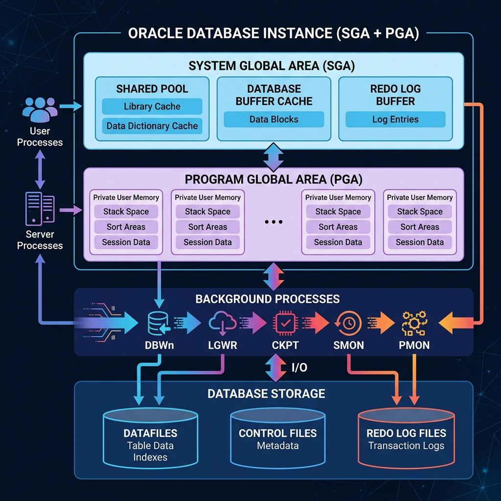

# Kiến trúc Oracle Instance (SGA, PGA và Processes)

Tài liệu này tóm tắt cấu trúc của một Oracle Instance, bao gồm cách quản lý bộ nhớ và các tiến trình nền.

---

## 1. Tổng quan về Instance
Một **Oracle Instance** là sự kết hợp giữa:
- **Bộ nhớ (Memory):** SGA và PGA.
- **Tiến trình (Processes):** Các background processes tương tác với memory và lưu trữ vật lý.



---

## 2. Kiến trúc Bộ nhớ (Memory Architecture)

### A. SGA (System Global Area)
Vùng nhớ dùng chung cho tất cả các tiến trình. Các thành phần chính bao gồm:

| Thành phần | Chức năng chính |
| :--- | :--- |
| **Shared Pool** | Lưu giữ các câu lệnh SQL đã biên dịch (Library Cache) và định nghĩa bảng (Data Dictionary). |
| **Database Buffer Cache** | Nơi lưu trữ các block dữ liệu được đọc từ ổ cứng. Giúp giảm thiểu việc đọc đĩa. |
| **Redo Log Buffer** | Lưu nhật ký thay đổi của Database. Đảm bảo khả năng phục hồi khi có sự cố. |
| **Large Pool** | Dùng cho các tác vụ lớn (RMAN backup, Parallel query). |
| **Java/Stream Pool** | Chạy mã Java và phục vụ trao đổi dữ liệu (Streams). |

### B. PGA (Program Global Area)
Vùng nhớ riêng tư cho mỗi phiên kết nối (Session). Nó chứa:
- **Sort Area:** Dùng cho các lệnh `ORDER BY`, `GROUP BY`.
- **Hash Area:** Dùng cho các phép Join bảng.
- **Session Records:** Lưu trạng thái của người dùng.

---

## 3. Sơ đồ Luân chuyển Dữ liệu

```mermaid
graph TD
    subgraph "User"
        User[User / Application]
    end

    subgraph "Oracle Instance (Memory)"
        direction TB
        subgraph SGA ["SGA (Shared Area)"]
            SP[Shared Pool]
            BC[DB Buffer Cache]
            RLB[Redo Log Buffer]
        end
        
        subgraph PGA ["PGA (Private Area)"]
            Private[Memory cá nhân / Sort Area]
        end
    end

    subgraph "Background Processes"
        DBWn[DBWn: Ghi dữ liệu]
        LGWR[LGWR: Ghi Log]
        CKPT[CKPT: Checkpoint]
    end

    subgraph "Disk (Physical Storage)"
        DF[Datafiles]
        RLF[Redo Log Files]
        CF[Control Files]
    end

    User -->|Connect| Private
    User -->|Query| SP
    SP --> BC
    BC <-->|Sync| DBWn
    DBWn --> DF
    RLB --> LGWR
    LGWR --> RLF
    CKPT -.-> CF
```

---

## 4. Các Tiến trình Nền Quan trọng (Background Processes)

- **DBWn (Database Writer):** Đẩy dữ liệu từ Buffer Cache xuống Datafiles.
- **LGWR (Log Writer):** Ghi nhật ký từ Redo Log Buffer vào Redo Log Files.
- **CKPT (Checkpoint):** Cập nhật Control Files và Header của Datafiles để báo hiệu điểm an toàn dữ liệu.
- **PMON (Process Monitor):** Dọn dẹp các tiến trình bị lỗi đột ngột.
- **SMON (System Monitor):** Phục hồi hệ thống khi khởi động lại sau sự cố.

---

*Tài liệu được biên soạn để phục vụ việc học tập và tra cứu nhanh về Oracle Database.*
