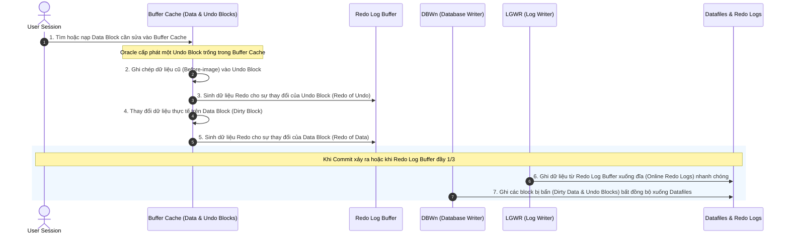
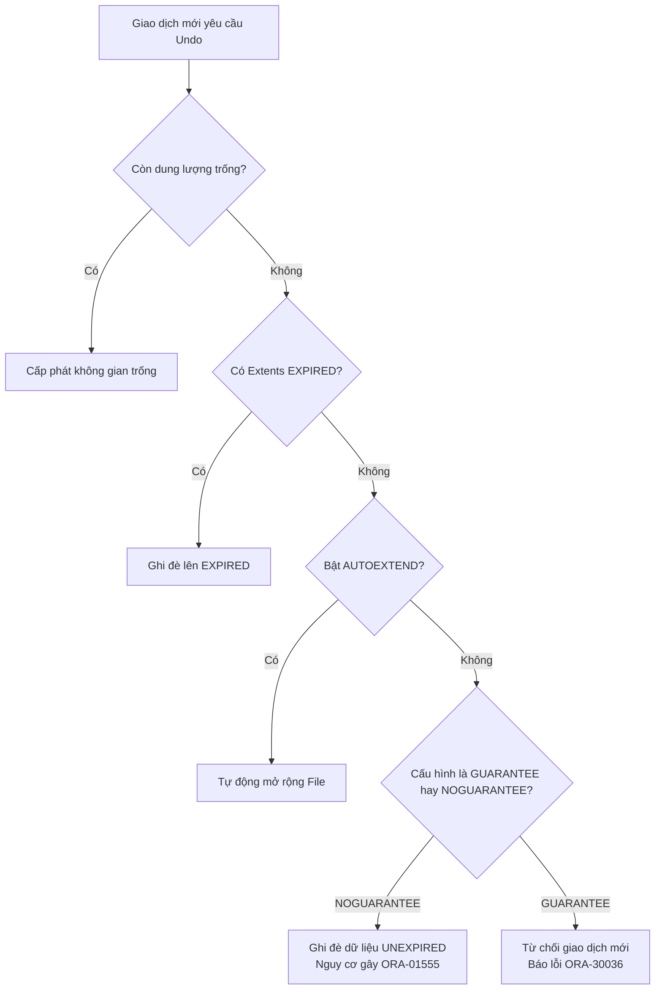

# TÀI LIỆU TOÀN DIỆN VỀ QUẢN TRỊ UNDO TRONG ORACLE DATABASE
*Biên soạn chi tiết theo các đề mục kỹ thuật chuyên sâu*

---

## MỤC LỤC
1. [Cơ chế DML và Quá trình Tạo Dữ liệu Undo](#1-cơ-chế-dml-và-quá-trình-tạo-dữ-liệu-undo)
2. [Giám sát và Quản trị Dữ liệu Undo](#2-giám-sát-và-quản-trị-dữ-liệu-undo)
3. [Phân biệt chi tiết giữa Dữ liệu Undo và Redo](#3-phân-biệt-chi-tiết-giữa-dữ-liệu-undo-và-redo)
4. [Cấu hình Tham số `UNDO_RETENTION`](#4-cấu-hình-tham-số-undo_retention)
5. [Cơ chế Đảm bảo Đủ Thời gian Lưu trữ Dữ liệu Undo (Retention Guarantee)](#5-cơ-chế-đảm-bảo-đủ-thời-gian-lưu-trực-dữ-liệu-undo-retention-guarantee)
6. [Sử dụng Temporary Undo trong Oracle Database](#6-sử-dụng-temporary-undo-trong-oracle-database)
7. [Sử dụng Công cụ Undo Advisor và Công thức Tính toán Dung lượng Thực tế](#7-sử-dụng-công-cụ-undo-advisor-và-công-thức-tính-toán-dung-lượng-thực-tế)

---

## 1. Cơ chế DML và Quá trình Tạo Dữ liệu Undo

### 1.1. Dữ liệu Undo là gì?
Dữ liệu **Undo** (hoặc Rollback) là bản ghi lại các thông tin dữ liệu ở trạng thái cũ (**Before-Image**) trước khi bị thay đổi bởi các câu lệnh DML (`INSERT`, `UPDATE`, `DELETE`).

Dữ liệu Undo đóng vai trò cực kỳ quan trọng trong Oracle Database với 4 mục đích chính:
1. **Rollback Giao dịch (Transaction Rollback):** Khi người dùng thực hiện lệnh `ROLLBACK` hoặc khi một giao dịch bị lỗi giữa chừng, Oracle dùng dữ liệu Undo để hoàn trả dữ liệu về trạng thái ban đầu.
2. **Nhất quán Đọc (Read Consistency - MVCC):** Oracle áp dụng cơ chế Đa phiên bản (Multi-Version Concurrency Control). Khi Tiến trình A đang sửa đổi dữ liệu (chưa Commit), Tiến trình B vào đọc sẽ không bị khóa mà được Oracle hướng sang vùng Undo để đọc phiên bản dữ liệu đã Commit trước đó.
3. **Các tính năng Flashback:** Hỗ trợ truy vấn dữ liệu trong quá khứ (`Flashback Query`, `Flashback Table`, `Flashback Transaction`).
4. **Khôi phục Hệ thống (Instance Recovery):** Nếu database bị sập đột ngột, trong quá trình khởi động lại, Oracle sẽ thực hiện Rollforward (áp dụng Redo) và sau đó là Rollback (áp dụng Undo) để loại bỏ toàn bộ dữ liệu của các giao dịch chưa được Commit trước thời điểm sập.

### 1.2. Lượng dữ liệu Undo sinh ra đối với từng lệnh DML
Mỗi loại câu lệnh DML sinh ra lượng dữ liệu Undo khác nhau do tính chất khôi phục của chúng:
*   **Lệnh `INSERT`:** Sinh ra **ít Undo nhất**. Oracle chỉ cần lưu trữ `ROWID` của dòng mới được chèn. Nếu Rollback, Oracle chỉ việc dựa vào `ROWID` để xóa dòng đó đi.
*   **Lệnh `UPDATE`:** Sinh ra **lượng Undo trung bình**. Oracle lưu trữ giá trị cũ (trước khi sửa) của các cột bị thay đổi. Nếu Rollback, Oracle sẽ ghi đè giá trị cũ này lên lại.
*   **Lệnh `DELETE`:** Sinh ra **nhiều Undo nhất**. Oracle phải lưu trữ toàn bộ tất cả các cột và giá trị của dòng bị xóa để đề phòng trường hợp Rollback thì thực hiện chèn lại toàn bộ dòng dữ liệu đó.

### 1.3. Quá trình DML và luồng dữ liệu (Workflow)
Khi một câu lệnh DML được thực thi, Oracle xử lý đồng thời cả Data Blocks, Undo Blocks và Redo Log Buffer theo các bước sau:



---

## 2. Giám sát và Quản trị Dữ liệu Undo

Oracle sử dụng cơ chế **Tự động Quản trị Undo (Automatic Undo Management - AUM)** thông qua một Tablespace đặc biệt gọi là **Undo Tablespace**.

### 2.1. Các câu lệnh quản trị cơ bản

*   **Tạo mới một Undo Tablespace:**
    ```sql
    CREATE UNDO TABLESPACE undotbs_pro01
    DATAFILE 'D:\app\oracle\oradata\orcl\undotbs_pro01.dbf' 
    SIZE 2G 
    AUTOEXTEND ON NEXT 500M MAXSIZE 16G;
    ```

*   **Chuyển đổi Undo Tablespace hoạt động của hệ thống:**
    ```sql
    ALTER SYSTEM SET UNDO_TABLESPACE = undotbs_pro01 SCOPE=BOTH;
    ```

*   **Xóa bỏ Undo Tablespace cũ (chỉ thực hiện được khi không còn transaction hoạt động trên đó):**
    ```sql
    DROP TABLESPACE undotbs_old INCLUDING CONTENTS AND DATAFILES;
    ```

### 2.2. Các câu lệnh SQL giám sát chuyên sâu cho DBA

#### Q1: Kiểm tra cấu hình Undo hiện tại của Hệ thống
```sql
SHOW PARAMETER undo;
```
*Kết quả sẽ hiển thị `undo_management` (phải là AUTO), `undo_tablespace` (tên tablespace hiện tại) và `undo_retention`.*

#### Q2: Kiểm tra dung lượng và tỷ lệ sử dụng hiện tại của Undo Tablespace
```sql
SELECT 
    tablespace_name,
    ROUND(sum(bytes) / 1024 / 1024, 2) AS total_space_mb,
    ROUND(sum(maxbytes) / 1024 / 1024, 2) AS max_size_mb
FROM 
    dba_data_files
WHERE 
    tablespace_name IN (SELECT value FROM v$parameter WHERE name = 'undo_tablespace')
GROUP BY 
    tablespace_name;
```

#### Q3: Giám sát trạng thái chi tiết của các Undo Extents (Quan trọng nhất)
Trạng thái của các extents trong Undo Tablespace thể hiện trực tiếp sức khỏe hệ thống:
```sql
SELECT 
    status, 
    ROUND(SUM(bytes)/(1024*1024), 2) AS size_mb, 
    COUNT(*) AS extent_count
FROM 
    dba_undo_extents
GROUP BY 
    status;
```
> [!NOTE]
> *   **ACTIVE:** Dữ liệu Undo của các transaction chưa commit. Tuyệt đối không được ghi đè.
> *   **UNEXPIRED:** Giao dịch đã commit nhưng thời gian tồn tại chưa vượt quá `UNDO_RETENTION`.
> *   **EXPIRED:** Giao dịch đã commit và đã nằm lâu hơn thời gian `UNDO_RETENTION`. Sẵn sàng bị ghi đè.

#### Q4: Tìm kiếm các session đang chiếm dụng nhiều tài nguyên Undo nhất
```sql
SELECT 
    s.sid,
    s.serial#,
    s.username,
    s.program,
    t.used_urec AS undo_records,
    ROUND(t.used_ublk * 8192 / 1024 / 1024, 2) AS undo_used_mb,
    t.start_time
FROM 
    v$transaction t
JOIN 
    v$session s ON t.ses_addr = s.saddr
ORDER BY 
    undo_used_mb DESC;
```

---

## 3. Phân biệt chi tiết giữa Dữ liệu Undo và Redo

Đây là hai khái niệm cốt lõi trong Oracle nhưng rất dễ bị nhầm lẫn. Bảng so sánh dưới đây phân tách rõ rệt:

| Tiêu chí | Dữ liệu Undo (Undo Data) | Dữ liệu Redo (Redo Data) |
| :--- | :--- | :--- |
| **Bản chất** | Bản ghi trạng thái cũ (**Before-Image**). | Bản ghi các thay đổi (**Change Vectors / Redo Entries**). |
| **Mục đích chính** | - Rollback giao dịch.<br>- Đảm bảo Read Consistency (đọc nhất quán).<br>- Hỗ trợ Flashback. | - Bảo vệ tính bền vững (Durability) dữ liệu.<br>- Khôi phục hệ thống khi mất điện đột ngột hoặc hỏng ổ đĩa. |
| **Nơi lưu trữ** | **Undo Tablespace** (các tệp dữ liệu `.dbf` thông thường). | **Redo Log Files** (Online Redo Logs & Archived Redo Logs - `.log`/`.arc`). |
| **Tiến trình ghi** | Ghi thông qua Database Buffer Cache rồi được **DBWn** ghi xuống đĩa bất đồng bộ. | Được ghi trực tiếp cực nhanh từ Redo Log Buffer xuống đĩa bởi tiến trình **LGWR**. |
| **Hướng khôi phục** | **Backward** (Giật lùi về quá khứ để hoàn tác lỗi). | **Forward** (Tiến về phía trước để tái áp dụng thay đổi). |
| **Khi nào được sinh ra?** | Chỉ sinh ra khi có hoạt động sửa đổi dữ liệu (DML: `INSERT`, `UPDATE`, `DELETE`). | Sinh ra khi có DML, DDL (`CREATE`, `ALTER`, `DROP`) và **ngay cả khi tạo dữ liệu Undo cũng sinh ra Redo** (Redo of Undo). |
| **Ảnh hưởng cấu hình** | Có thể ghi đè nếu hết dung lượng (trừ khi bật Guarantee). | Luôn ghi xoay vòng. Nếu không lưu trữ (Archive) kịp, hệ thống sẽ bị treo tạm thời (Archiver Stuck). |

---

## 4. Cấu hình Tham số `UNDO_RETENTION`

### 4.1. Khái niệm `UNDO_RETENTION`
`UNDO_RETENTION` là một tham số động (Dynamic Parameter), quy định **thời gian tối thiểu (tính bằng giây)** mà Oracle sẽ cố gắng giữ lại dữ liệu Undo sau khi giao dịch đã được **Commit**.

*   Mục đích: Đảm bảo các câu lệnh truy vấn dài (Long-running queries) chạy sau đó không bị lỗi **`ORA-01555: snapshot too old`** do dữ liệu cũ bị ghi đè quá sớm.
*   Mặc định: Oracle đặt giá trị này là `900` giây (15 phút).

### 4.2. Cách thức kiểm tra và thay đổi cấu hình

*   **Kiểm tra giá trị hiện tại:**
    ```sql
    SELECT name, value, isdefault 
    FROM v$parameter 
    WHERE name = 'undo_retention';
    ```

*   **Tăng thời gian giữ trữ lên 3 tiếng (10,800 giây):**
    ```sql
    ALTER SYSTEM SET UNDO_RETENTION = 10800 SCOPE=BOTH;
    ```

### 4.3. Nguyên lý thu hồi không gian trong Undo Tablespace
Khi một giao dịch mới yêu cầu không gian lưu trữ Undo, Oracle sẽ ưu tiên tìm kiếm và sử dụng theo thứ tự:
1. Không gian trống hoàn toàn (Free Space) trong Tablespace.
2. Các Block mang trạng thái **EXPIRED** (đã commit và vượt quá thời gian `UNDO_RETENTION`).
3. Tự động mở rộng Datafile (nếu Datafile cấu hình `AUTOEXTEND ON`).
4. Ghi đè vào các Block mang trạng thái **UNEXPIRED** (nếu Tablespace ở chế độ `NOGUARANTEE`).
5. Nếu không còn gì để dùng, giao dịch sẽ lỗi: `ORA-30036: unable to extend segment...`.

---

## 5. Cơ chế Đảm bảo Đủ Thời gian Lưu trữ Dữ liệu Undo (Retention Guarantee)

Mặc dù ta cấu hình `UNDO_RETENTION = 10800` (3 tiếng), Oracle mặc định chạy ở chế độ **`NOGUARANTEE`**. Điều đó có nghĩa là nếu Undo Tablespace bị đầy dữ liệu và các giao dịch DML mới liên tục đổ về, Oracle sẵn sàng **ghi đè** (overwrite) lên dữ liệu Undo `UNEXPIRED` để ưu tiên các giao dịch mới chạy thành công. Hậu quả là các câu lệnh Select dài chạy song song sẽ bị dính lỗi `ORA-01555`.

Để giải quyết triệt để, Oracle cung cấp cơ chế **Retention Guarantee**.



### 5.1. Kích hoạt Retention Guarantee
Khi bật tính năng này, Oracle **tuyệt đối không bao giờ** cho phép ghi đè lên dữ liệu `UNEXPIRED`. Giao dịch DML mới sẽ chấp nhận bị lỗi thay vì làm hỏng dữ liệu nhất quán của các truy vấn dài đang chạy.

*   **Kích hoạt cho Tablespace hiện tại:**
    ```sql
    ALTER TABLESPACE undotbs1 RETENTION GUARANTEE;
    ```

*   **Tắt chế độ đảm bảo (Quay lại mặc định):**
    ```sql
    ALTER TABLESPACE undotbs1 RETENTION NOGUARANTEE;
    ```

*   **Truy vấn kiểm tra trạng thái hiện tại:**
    ```sql
    SELECT tablespace_name, retention 
    FROM dba_tablespaces 
    WHERE tablespace_name = 'UNDOTBS1';
    ```
    *Kết quả cột `RETENTION` hiển thị là `GUARANTEE` hoặc `NOGUARANTEE`.*

---

## 6. Sử dụng Temporary Undo trong Oracle Database

### 6.1. Vấn đề của bảng tạm (Global Temporary Tables - GTT) trước Oracle 12c
Trước phiên bản 12c, mọi thao tác sửa đổi trên bảng tạm (`GTT`) đều sinh ra dữ liệu Undo nằm tại hệ thống Undo Tablespace trung tâm. Điều này kéo theo:
*   Sinh ra dữ liệu Redo cho chính phần Undo đó (Redo of Undo).
*   Gây tắc nghẽn IO và phình to Undo Tablespace hệ thống bởi các dữ liệu tạm thời (vốn dĩ sẽ biến mất sau khi kết thúc session/commit).

### 6.2. Cơ chế Temporary Undo (Từ bản Oracle 12c trở đi)
Temporary Undo cho phép chuyển toàn bộ dữ liệu Undo của bảng tạm sang lưu giữ tại **Temporary Tablespace (TEMP)** thay vì Undo Tablespace truyền thống.

> [!TIP]
> **Lợi ích vượt trội:**
> 1. **Không sinh dữ liệu Redo:** Dữ liệu trong Temp Tablespace không cần phục hồi khi sập nguồn (Instance Recovery), do đó Oracle bỏ qua việc sinh Redo cho phần Temporary Undo này. Tiết kiệm tài nguyên đĩa vô cùng lớn.
> 2. Giảm tải áp lực dung lượng cho Undo Tablespace chính.
> 3. Tăng tốc hiệu năng xử lý DML trên bảng tạm.
> 4. Cho phép chạy các lệnh sửa đổi GTT trên database phụ phụ thuộc (Active Data Guard Standby) vốn là môi trường chỉ đọc.

### 6.3. Cấu hình Temporary Undo

Tham số điều khiển tính năng này là `TEMP_UNDO_ENABLED`.

*   **Kích hoạt ở cấp độ toàn hệ thống (System level):**
    ```sql
    ALTER SYSTEM SET TEMP_UNDO_ENABLED = TRUE SCOPE=BOTH;
    ```

*   **Kích hoạt ở cấp độ phiên làm việc (Session level - Khuyên dùng cho các tiến trình Batch Job lớn):**
    ```sql
    ALTER SESSION SET TEMP_UNDO_ENABLED = TRUE;
    ```

*   **Kiểm tra cấu hình hiện tại:**
    ```sql
    SELECT name, value 
    FROM v$parameter 
    WHERE name = 'temp_undo_enabled';
    ```

---

## 7. Sử dụng Công cụ Undo Advisor và Công thức Tính toán Dung lượng Thực tế

### 7.1. Sử dụng Undo Advisor qua PL/SQL
**Undo Advisor** là một cố vấn thông minh được Oracle tích hợp sẵn giúp phân tích lịch sử tải của hệ thống và đưa ra khuyến nghị dung lượng tối ưu cho Undo Tablespace để đáp ứng mục tiêu `UNDO_RETENTION`.

Dưới đây là tập lệnh PL/SQL hoàn chỉnh giúp DBA chạy Undo Advisor trực tiếp:

```sql
DECLARE
    v_task_name VARCHAR2(100) := 'Undo_Advisor_Task_01';
    v_advice    VARCHAR2(4000);
BEGIN
    -- 1. Tạo tác vụ phân tích (Advisor Task)
    DBMS_ADVISOR.CREATE_TASK (
        advisor_name => 'Undo Advisor',
        task_name    => v_task_name,
        task_desc    => 'Phân tích dung lượng Undo Tablespace'
    );
    
    -- 2. Thực thi phân tích dựa trên lịch sử hoạt động hệ thống
    DBMS_ADVISOR.EXECUTE_TASK (task_name => v_task_name);
    
    DBMS_OUTPUT.PUT_LINE('Khởi chạy tác vụ phân tích thành công!');
END;
/

-- 3. Truy vấn kết quả đề xuất từ Advisor
SELECT 
    recommendation, 
    action, 
    benefit
FROM 
    dba_advisor_recommendations
WHERE 
    task_name = 'Undo_Advisor_Task_01';
```

### 7.2. Tự tính toán dung lượng Undo thủ công bằng SQL
Nếu không dùng Advisor, DBA kỳ cựu thường sử dụng công thức thực nghiệm chuẩn của Oracle để ước tính kích thước tối ưu cho Undo Tablespace:

$$\text{Dung lượng tối ưu (Bytes)} = \text{Undo Retention (Giây)} \times \text{Tốc độ sinh Undo lớn nhất (Bytes/Giây)} + \text{Dung lượng Overhead}$$

Đoạn SQL dưới đây sẽ tự động quét qua lịch sử hoạt động thực tế trên DB của bạn (lấy từ `V$UNDOSTAT` trong 7 ngày gần nhất) để tính ra dung lượng đề xuất chính xác (tính bằng MB):

```sql
SELECT 
    ur.value AS current_undo_retention_sec,
    db_size.db_block_size_bytes,
    max_stats.max_undo_blocks_per_sec,
    -- Áp dụng công thức tính toán
    ROUND(
        (ur.value * max_stats.max_undo_blocks_per_sec * db_size.db_block_size_bytes) / (1024 * 1024), 
        2
    ) AS recommended_undo_size_mb
FROM 
    -- 1. Lấy cấu hình UNDO_RETENTION hiện tại
    (SELECT value FROM v$parameter WHERE name = 'undo_retention') ur,
    -- 2. Lấy kích thước Block của Database (thông thường là 8192 bytes)
    (SELECT value AS db_block_size_bytes FROM v$parameter WHERE name = 'db_block_size') db_size,
    -- 3. Tìm số block undo sinh ra lớn nhất trên một giây trong lịch sử
    (
        SELECT MAX(undoblks / ((end_time - begin_time) * 86400)) AS max_undo_blocks_per_sec 
        FROM v$undostat
    ) max_stats;
```

---
*Tài liệu được thiết kế trực quan và chuẩn hóa cao giúp dễ dàng nhúng trực tiếp vào các tài liệu hướng dẫn kỹ thuật nội bộ (Runbook/Playbook) của doanh nghiệp.*
